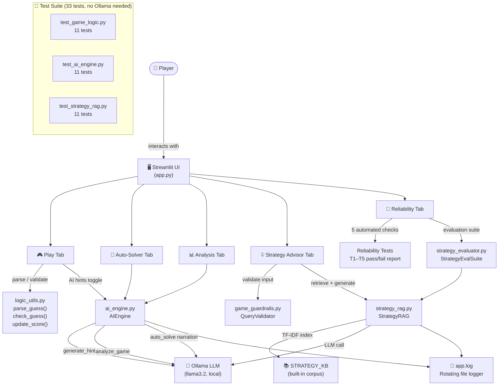

# System Architecture Diagram



## Component Descriptions

| Component | File | Role |
|-----------|------|------|
| Streamlit UI | `app.py` | 5-tab app — Play, Auto-Solver, Analysis, Strategy Advisor, Reliability |
| AI Engine | `ai_engine.py` | `generate_hint`, `auto_solve` (Plan→Act→Check→Reflect), `analyze_game` |
| Game Logic | `logic_utils.py` | `parse_guess`, `check_guess`, `update_score`, `get_range_for_difficulty` |
| Strategy RAG | `strategy_rag.py` | TF-IDF retrieval over built-in KB → Ollama-generated grounded advice |
| Game Guardrails | `game_guardrails.py` | Input validation (query length), hint output direction validation |
| Strategy Evaluator | `strategy_evaluator.py` | 5-case eval suite: keyword + citation checks on RAG advice |
| LLM | Ollama (llama3.2) | Local inference — hints, solver narration, game analysis, strategy advice |
| Logger | `app.log` | Rotating file — all game events, AI calls, errors |

## Agentic Auto-Solver Loop

```
┌─────────────────────────────────────────────┐
│  for each step until Win or max_attempts:   │
│                                             │
│  1. PLAN   → pick midpoint(low, high)       │
│  2. ACT    → submit guess                   │
│  3. CHECK  → compare to secret, narrow range│
│  4. REFLECT→ Ollama narrates the step       │
└─────────────────────────────────────────────┘
```

## RAG Strategy Advisor Flow

```
Player Question
      │
      ▼
QueryValidator.validate_query()   ← guardrail: empty / too short / too long
      │
      ▼
StrategyRAG.retrieve()            ← TF-IDF cosine similarity over STRATEGY_KB
      │  top-3 chunks
      ▼
StrategyRAG.generate_advice()     ← builds [STRATEGY N]-cited prompt → Ollama
      │                              fallback: returns raw chunk text if Ollama down
      ▼
Advice + confidence score + expandable source excerpts
```
